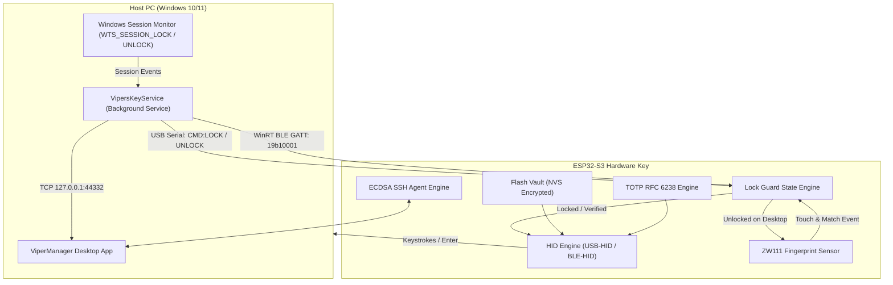

# 🛡️ Viper's Biometric Key
### Open-Source Biometric Hardware Key (ESP32-S3 Super Mini + ZW111)

**Viper's Biometric Key** is an open-source, dual-mode (**Wired USB-HID + Wireless Bluetooth BLE-HID**) biometric security key built on the **ESP32-S3 Super Mini** and the **ZW111 (HLK-ZW111)** capacitive fingerprint sensor.

Unlike standard DIY keyboard injection projects that blindly dump credentials into open text editors, Viper's Key features an **Intelligent Windows Lock State Guard** that actively prevents plaintext password leaks by coordinating with the host OS. When the PC is unlocked, credential injection is safely suppressed and signaled via the sensor's RGB ring.

---

## ✨ Features

- **Dual-Mode Connectivity**:
  - **Wired USB-HID**: Native USB keyboard emulation with automated wake-and-unlock sequences.
  - **Wireless Bluetooth BLE-HID**: NimBLE-based wireless keyboard pairing with Windows 10/11, macOS, and Linux.
- **Biometric Security Guard (Anti-Leak Engine)**:
  - Background service monitors Windows session lock state (`WTS_SESSION_LOCK` / `WTS_SESSION_UNLOCK`).
  - Broadcasts real-time lock state heartbeats over USB Serial and WinRT BLE GATT (`19b10001-...`).
  - Touching the sensor on an unlocked desktop will **never** leak credentials in plain text; the sensor gracefully signals yellow.
- **Hardware-Backed SSH Keys**:
  - Unextractable hardware-generated ECDSA (`secp256r1`) keypairs.
  - Exports standard OpenSSH public keys (`ecdsa-sha2-nistp256`).
  - Challenge-response signing with physical touch verification (sensor pulses purple).
- **Live TOTP 2FA Authenticator**:
  - On-chip Base32 secret storage and live RFC 6238 TOTP computation.
  - Dedicated fingerprint slot binding: scanning a specific finger types the live 6-digit 2FA code into browser prompts without pressing Enter.
- **Fingerprint Studio (40 Slots)**:
  - 6-stage guided enrollment wizard (center pad, edges, tip, lower pad).
  - Assign distinct actions per finger (Unlock Host OS, Type TOTP 2FA Code).
- **Modern Desktop Manager (`ViperManager`)**:
  - Built with C# and Avalonia UI.
  - Available as an automated Windows Installer and a standalone Portable single-file executable.
  - Automatic background service port handover (seamless COM port arbitration via local socket override).

---

## 🔌 Hardware Components & Wiring

### Bill of Materials
1. **ESP32-S3 Super Mini** (Dual-Core Xtensa LX7 @ 240MHz, Native USB OTG)
2. **ZW111 (HLK-ZW111)** Capacitive Fingerprint Sensor Module
3. *(Optional for wireless use)* 3.7V Li-Po battery connected to 3.3V/VBAT and GND

### Wiring Diagram

| ZW111 Sensor Pin | Sensor Pin Name | ESP32-S3 Super Mini Pin | Description |
| :--- | :--- | :--- | :--- |
| **Pin 1** | **TOUCH_VCC** | **3V3** | Power for Capacitive Touch Detection Circuit |
| **Pin 2** | **TOUCH_OUT** | **GPIO 1** | Touch Ring Interrupt (Microcontroller Wakeup) |
| **Pin 3** | **VCC / VDD** | **3V3** | Main 3.3V Sensor Power |
| **Pin 4** | **TX** | **GPIO 44 (RX)** | Sensor Serial Data Out -> ESP32 Serial1 RX |
| **Pin 5** | **RX** | **GPIO 43 (TX)** | Sensor Serial Data In <- ESP32 Serial1 TX |
| **Pin 6** | **GND** | **GND** | Common Ground |

> [!NOTE]
> Both the ESP32-S3 Super Mini and ZW111 sensor operate on native 3.3V logic. No logic level shifters or voltage divider resistors are required.
> The onboard status LED on the ESP32-S3 Super Mini is mapped to **GPIO 8**.

---

## 💡 Hardware Ring LED Indicators

The ZW111 sensor features an integrated RGB LED ring providing real-time hardware status:

| LED Color & Pattern | Meaning / System State |
| :--- | :--- |
| **Breathing Blue** | Idle, powered, and waiting for fingerprint touch |
| **Solid Blue** | Capacitive finger contact detected on the outer metal bezel |
| **Flashing Green** | Fingerprint recognized & authentication action verified |
| **Flashing Red** | Fingerprint not recognized or sensor enrollment error |
| **Flashing Yellow** | **Lock Guard Active**: Windows is unlocked; password typing blocked for security |
| **Flashing Purple** | **SSH Sign Request**: Hardware waiting for touch to authorize key signature |
| **Breathing Cyan** | Initial boot sequence and hardware initialization OK |

---

## 🚀 Flashing the Firmware

The firmware is located in both `VipersKey/` (Arduino IDE) and `firmware/` (PlatformIO).

### Option A: Arduino IDE (Recommended for Beginners)
1. Install **ESP32 Board Support**:
   - `Tools -> Board -> Boards Manager -> esp32 by Espressif` (version `2.0.14` or later).
2. Install Required Library:
   - `Sketch -> Include Library -> Manage Libraries -> NimBLE-Arduino` (by h2zero).
3. Board Configuration:
   - **Board**: `ESP32S3 Dev Module`
   - **USB Mode**: `Hardware CDC and JTAG`
   - **USB CDC On Boot**: `Enabled`
   - **Flash Mode**: `QIO 80MHz`
   - **Partition Scheme**: `Default 4MB with spiffs`
4. Open `VipersKey/VipersKey.ino` and click **Upload**.

### Option B: PlatformIO (VS Code / CLI)
1. Navigate to the `firmware` directory:
   ```bash
   cd firmware
   ```
2. Build and upload:
   ```bash
   pio run -t upload
   ```

---

## 🖥️ Desktop Software & Setup

The project includes **ViperManager**, a modern C# Avalonia desktop application, and **VipersKeyService**, a native background service.

### 1. Ready-to-Use Applications (`dist/`)

The repository includes pre-built distributions in `dist/`:

- **Installable Edition (`dist/ViperManager-Installer/`)**:
  - Run `install.bat` as Administrator.
  - Automatically installs `ViperManager.exe` into `%ProgramFiles%\ViperKey`.
  - Creates Start Menu and Desktop shortcuts.
  - Installs and starts `VipersKeyService` in Windows Services (`services.msc`) for automatic USB and BLE lock state synchronization.
  - Run `uninstall.bat` to cleanly remove all files and services.
- **Portable Edition (`dist/ViperManager-Portable/`)**:
  - Run `ViperManager.exe` directly without installation or admin privileges.
  - Ideal for USB flash drives and portable toolkits.

### 2. Building from Source

To compile the manager manually:
```bash
cd software/ViperManager
dotnet publish -c Release -r win-x64 --self-contained true -p:PublishSingleFile=true -p:IncludeNativeLibrariesForSelfExtract=true
```

---

## 🔒 Security & Architecture Overview



### Authentication Sequence
1. **Lock Screen Wakeup**:
   - Over Bluetooth, the firmware sends a `Space` key, pauses for `1200ms` for Windows 11 lock screen slide animations to finish, clears any typed spaces with `Ctrl+A` -> `Backspace`, and reliably injects the credentials followed by `Enter`.
2. **Desktop Guard**:
   - When Windows is unlocked, the service sends `CMD:UNLOCK` heartbeats every 3 seconds.
   - Touching the sensor on the desktop blocks credential injection, protecting your password from being leaked into active text documents, terminals, or chat windows.
3. **Standalone Fallback**:
   - If unplugged from a PC running the service (e.g., plugged into an arbitrary Linux/Mac machine), the guard safely times out after 7 seconds, allowing the key to operate autonomously.

---

## 📜 License

This project is open-source under the **MIT License**.
